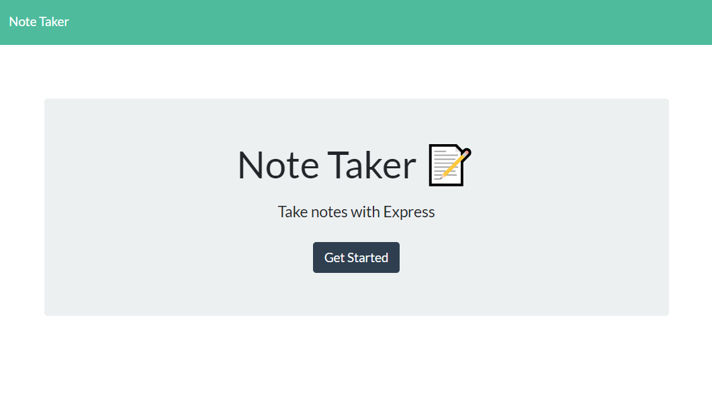

## Note Taker

## Table of Contents

- [Description](##Description)
- [How to Use it](##Instructions)
- [Languages Used](##Built-with)
- [Demo](##Demo)

    

## Description

An app that allows the user to save notes with a title and description. 

## Instructions

How to use:

* Install node to your machine
* In your command line type "install npm"
* Then in the Develop folder "enter index.js"
* Answer the questions in the terminal
* You newly created readme file will be in the dist folder

## Built with
- Node.js
- Express.js
- Javascript
- HTML
- CSS

## Demo

 [Application](https://lit-spire-87115.herokuapp.com/)